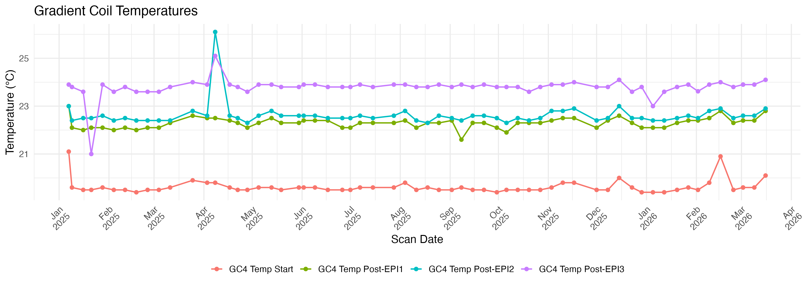
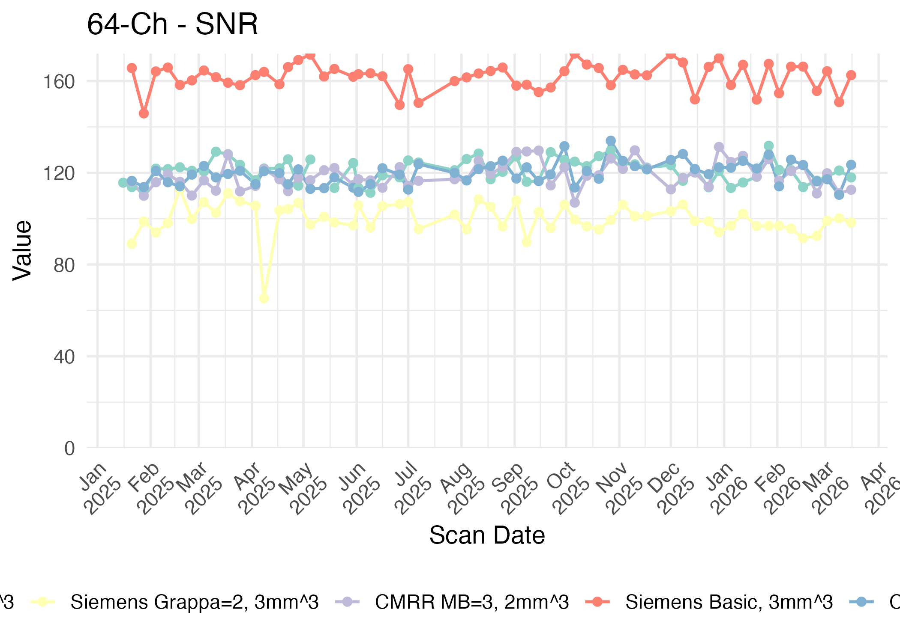
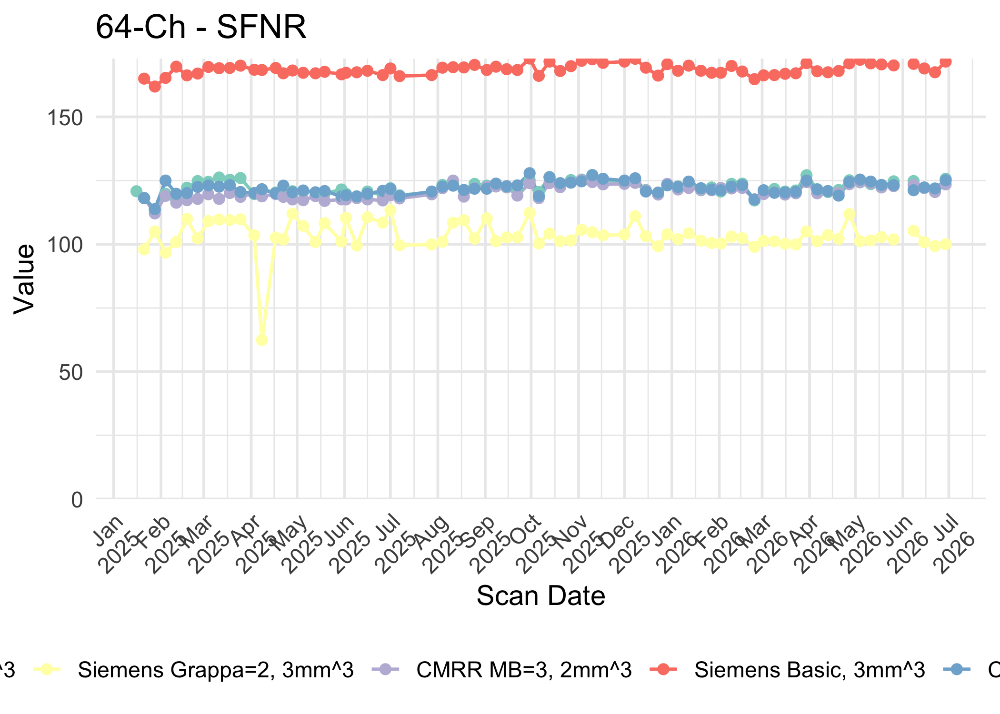
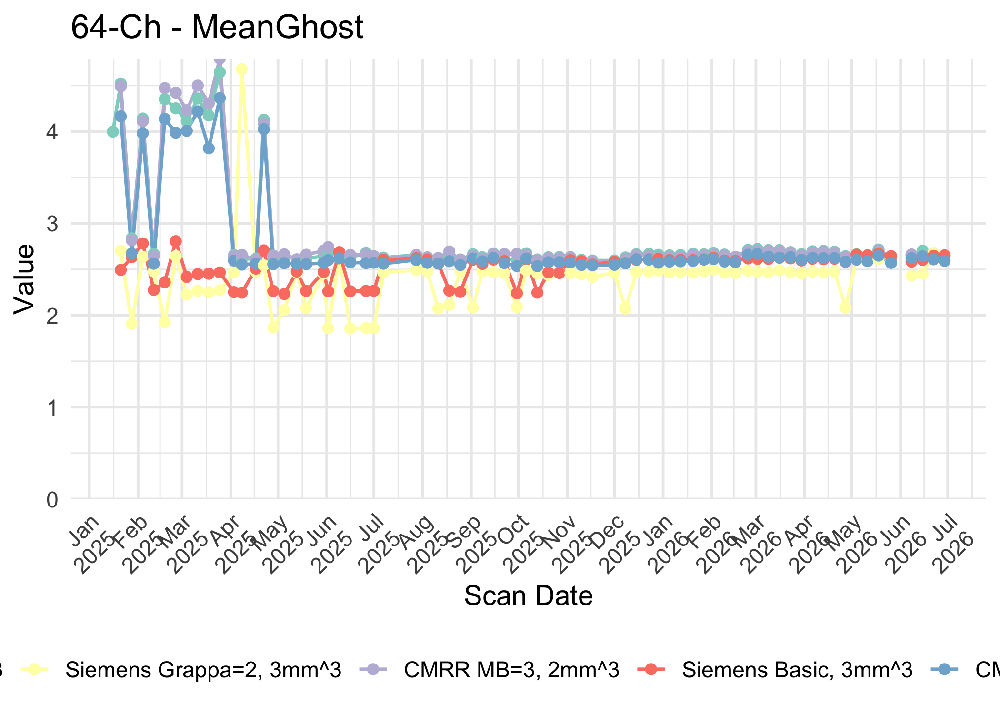
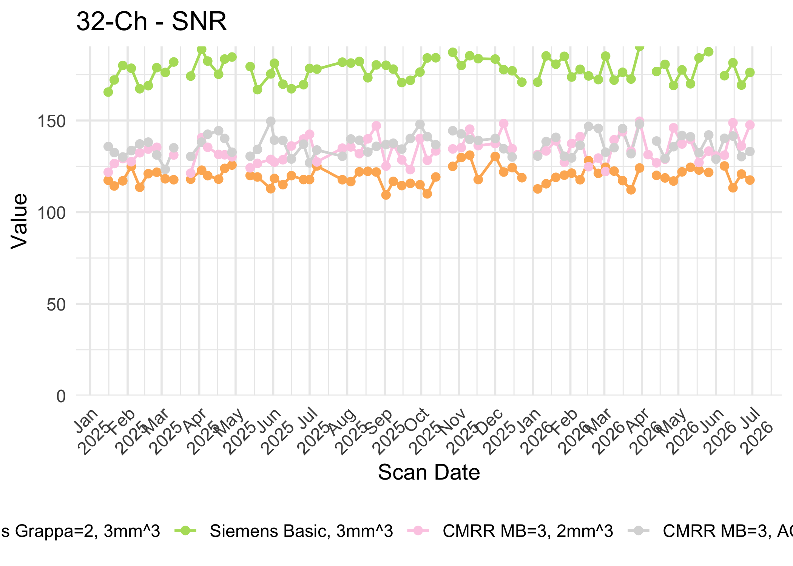
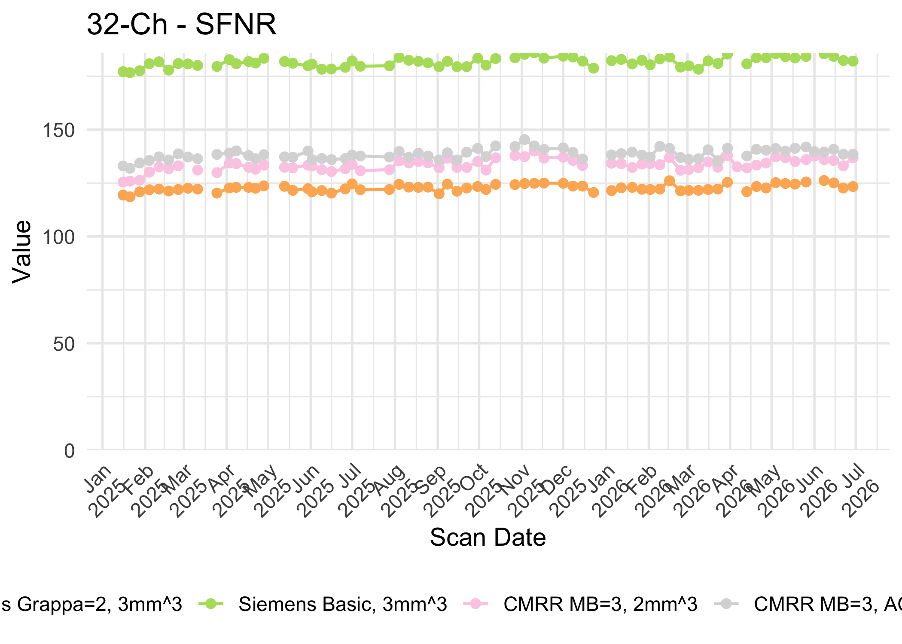
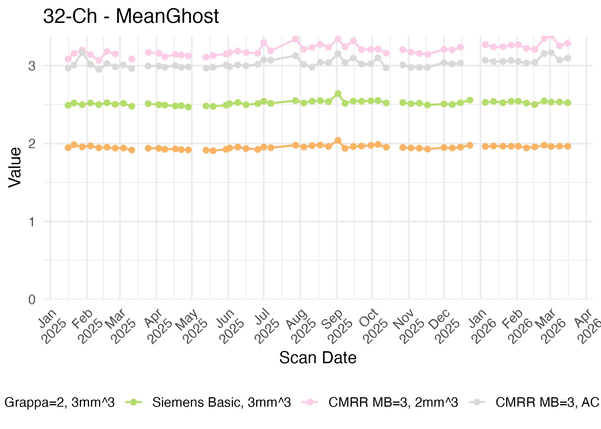
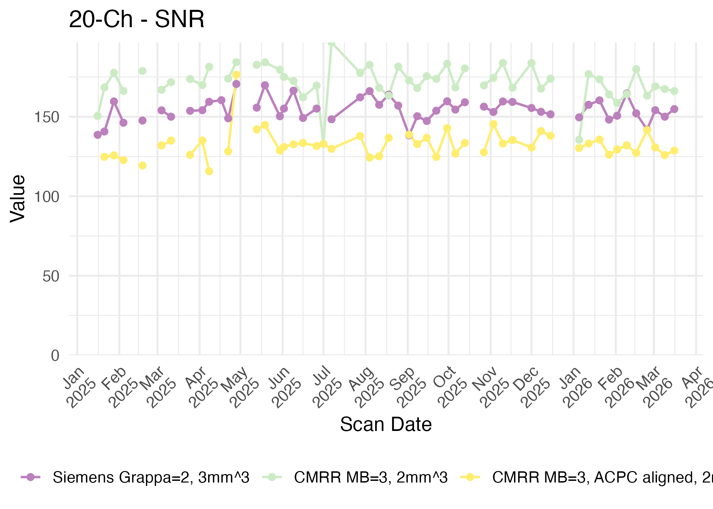
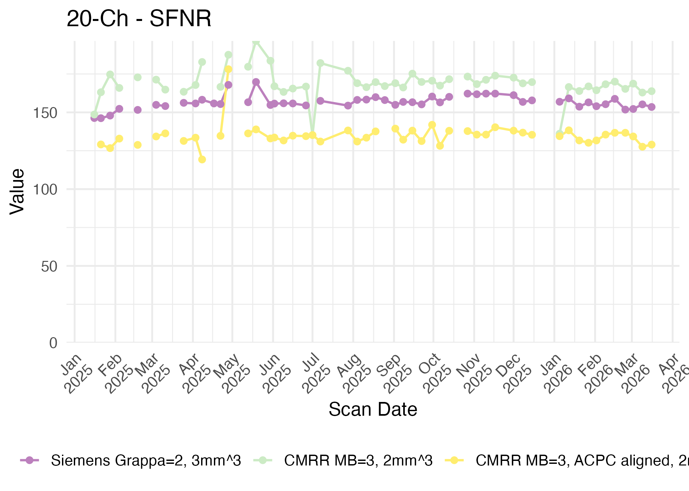
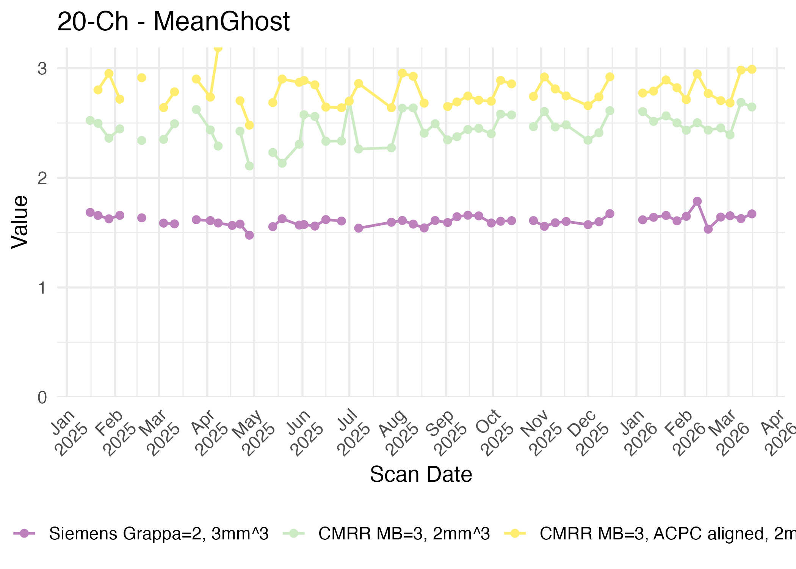

# stability-scanning

Weekly quality assurance (QA) scans assess the stability of the fMRI signal from the Cima.X scanner at the MindCORE Neuroimaging Facility. Stability scans are conducted using the 64-, 32-, and 20-channel head coils and both standard Siemens and CMRR multi-band EPI pulse sequences (denoted "Siemens" and "CMRR" in the figures below). The scan protocol is based on the recommendation of John Pyles and colleagues (Pyles et al, OHBM 2020) found here: [https://sites.google.com/view/mri-facility-qa](https://sites.google.com/view/mri-facility-qa). Scan parameters are typical of research protocols for TR, TE, and resolution. All scans in the plots above are in straight axial orientation unless specified as AC-PC aligned. Imaging is done on a [FUNSTAR phantom](https://goldstandardphantoms.com/products/funstar/) in the 64- and 32-channel coils using custom 3D-printed phantom holders. Stability is assessed using the Functional Imaging Federated Informatics Research Environment (FBIRN; see Friedman & Glover, 2006) QA metrics, which includes temporal signal to noise ratio (SNR), signal-to-fluctuation noise ratio (SFNR), and mean ghost percentage. QA metrics are assessed using a docker-ized version of the FBIRN QA scripts provided by Dr. Chandana Kodiweera of the Dartmouth Brain Imaging Center found here: [https://hub.docker.com/r/diffdocker/fbirnqa](https://hub.docker.com/r/diffdocker/fbirnqa).

For more on the weekly QA protocol, see this [blog post](https://mindcore.sas.upenn.edu/2025/04/08/mri-stability-scanning/).

## Scan Metrics (updated weekly)

### Gradient Coil Temperatures

### 64-channel coil metrics

### 32-channel coil summary

### 20-channel coil summary

